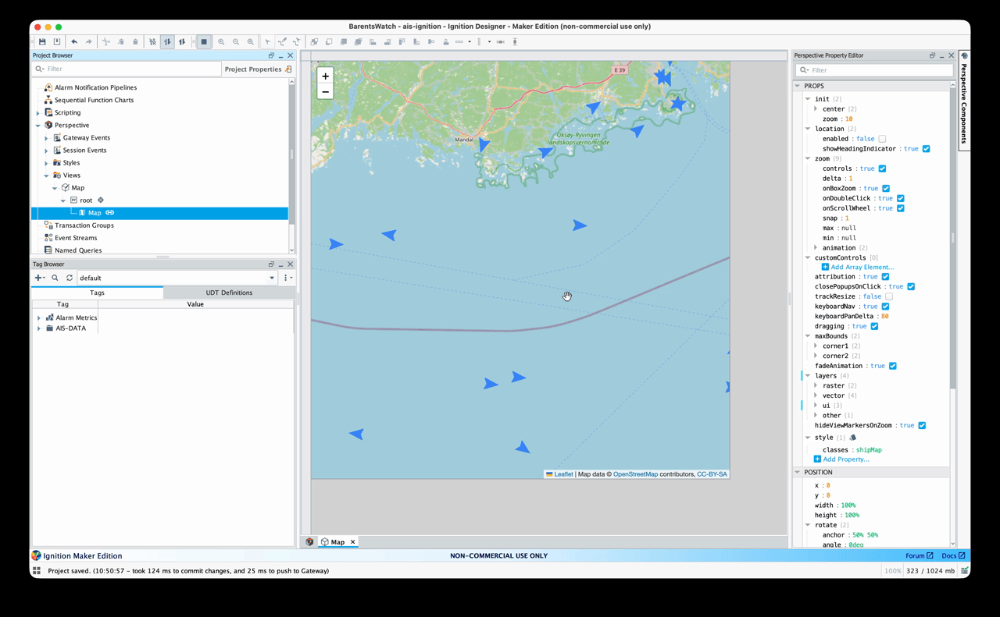

# BarentsWatch AIS → MQTT → Ignition

End-to-end demo that streams **live BarentsWatch AIS vessel data** through **Server-Sent Events (SSE)**, converts it to **MQTT** using [`sse-to-mqtt-node`](https://www.npmjs.com/package/sse-to-mqtt-node), and visualizes vessel movement in **Ignition Perspective**.

This project demonstrates how an external streaming API can be integrated with an industrial SCADA platform using MQTT as the messaging layer.



## Why this project exists

BarentsWatch provides live AIS vessel data through a continuously streamed HTTP/SSE API.

In industrial environments, systems such as Ignition SCADA may not always be the best place to directly manage long-lived SSE connections, authentication, reconnection, retries, and stream lifecycle management.

This demo separates those responsibilities:

```text
BarentsWatch Live AIS API
          │
          │ SSE + OAuth2
          ▼
┌────────────────────────┐
│    sse-to-mqtt-node    │
│                        │
│  SSE → MQTT bridge     │
└────────────┬───────────┘
             │
             │ MQTT
             ▼
┌────────────────────────┐
│   Eclipse Mosquitto    │
│     MQTT Broker        │
└────────────┬───────────┘
             │
             │ MQTT Engine
             ▼
┌────────────────────────┐
│    Ignition Gateway    │
│                        │
│      Perspective       │
└────────────┬───────────┘
             │
             ▼
       Live vessel map
```

The bridge handles the streaming connection and publishes AIS messages to MQTT. Ignition then consumes the MQTT data and uses it to update vessel positions on a Perspective map.

---

## Components

The demo consists of three main services.

### SSE → MQTT Bridge

The `bridge` application uses the [`sse-to-mqtt-node`](https://www.npmjs.com/package/sse-to-mqtt-node) package to:

- authenticate with BarentsWatch using OAuth2 client credentials
- connect to the BarentsWatch Live AIS SSE endpoint
- apply configured vessel/geographical filters
- maintain the streaming connection
- refresh access tokens when required
- publish received AIS events to MQTT
- reconnect automatically after connection failures
- shut down gracefully on `SIGINT` and `SIGTERM`

### MQTT Broker

The stack includes **Eclipse Mosquitto** with:

- username/password authentication
- anonymous access disabled
- persistent MQTT data
- authenticated health checks
- internal Docker networking
- loopback-only host exposure

### Ignition SCADA

The included Ignition project contains a saved **Perspective vessel-map visualization**.

Ignition consumes AIS messages through MQTT Engine and updates the corresponding vessel data used by the Perspective map.

---

# Quick Start

## 1. Install bridge dependencies

Use **Node.js 24** and npm.

From the repository root:

```sh
npm run setup
```

Create your local environment file if it does not already exist:

```sh
cp -n bridge/.env.example bridge/.env
```

Then update `bridge/.env` with your BarentsWatch and MQTT credentials.

---

## 2. Configure BarentsWatch credentials

Create or sign in to your BarentsWatch account:

[BarentsWatch MyPage / Min side](https://www.barentswatch.no/minside/)

Register an application and select **AIS-client**.

See the official documentation:

- [Application registration and authentication](https://developer.barentswatch.no/docs/appreg/)
- [Live AIS API](https://developer.barentswatch.no/docs/AIS/live-ais-api/)
- [AIS request examples](https://developer.barentswatch.no/docs/AIS/examples/)

Configure the following values in:

```text
bridge/.env
```

Example:

```env
STREAMING_ENDPOINT=https://live.ais.barentswatch.no/v1/combined

AUTHENTICATION_URL=https://id.barentswatch.no/connect/token
CLIENT_ID=your-client-id
CLIENT_SECRET=your-client-secret
CLIENT_SCOPE=ais

MQTT_BROKER_URL=mqtt://localhost:1883
MQTT_USERNAME=your-mqtt-user
MQTT_PASSWORD=your-mqtt-password
MQTT_TOPIC=ais

CONNECTIONS_CONFIG=config/connections.json
LOG_LEVEL=info
```

The CLI performs the OAuth2 **client-credentials flow automatically**.

You do not need to manually obtain or store an access token.

---

# Run the bridge locally

From the repository root:

```sh
npm start
```

Equivalent:

```sh
npm run start:bridge
```

Or directly inside the bridge project:

```sh
cd bridge
npm start
```

The bridge will:

1. load `bridge/.env`
2. load the saved connection definitions
3. obtain an OAuth token from BarentsWatch
4. connect to the Live AIS SSE stream
5. connect to the MQTT broker
6. publish received AIS data to MQTT

---

# Run the complete stack with Docker

With Docker running and `bridge/.env` configured:

```sh
docker compose up -d --build
```

Check service status:

```sh
docker compose ps
```

Watch bridge logs:

```sh
docker compose logs -f bridge
```

This starts:

```text
Bridge
Mosquitto
Ignition
```

Inside Docker, the bridge connects to the MQTT broker using:

```text
mqtt://mqtt:1883
```

The native bridge uses the value configured in `bridge/.env`, normally:

```text
mqtt://localhost:1883
```

---

# Data Flow

The saved configuration currently demonstrates AIS traffic around the **Kristiansand–Hirtshals ferry connection**.

BarentsWatch messages are received through the configured SSE connection and published using MQTT topic patterns defined in:

```text
bridge/config/connections.json
```

The current topic structure is:

```text
<MQTT_TOPIC>/<connection-name>/<imoNumber>
```

For example:

```text
ais/kristiansand-hirtshals/1234567
```

The connection name comes from the configured SSE connection.

The vessel name and other AIS information remain inside the JSON payload.

---

# Inspect MQTT Messages

To observe incoming AIS data directly from the Mosquitto container:

```sh
docker compose exec mqtt sh -c \
'mosquitto_sub -h localhost \
-u "$MQTT_USERNAME" \
-P "$MQTT_PASSWORD" \
-t "ais/#" -v'
```

If you change `MQTT_TOPIC`, update the subscription topic accordingly.

---

# Ignition Setup

The included Ignition Perspective project is located at:

```text
ignition/projects/BarentsWatch
```

Docker Compose mounts the project into:

```text
/usr/local/bin/ignition/data/projects
```

The Perspective project is named:

```text
BarentsWatch-AIS
```

and its main Map view is assigned to:

```text
/
```

## Start Ignition without live streaming

If you want to configure the Gateway before starting the BarentsWatch bridge:

```sh
docker compose up -d --build mqtt ignition
```

Check status:

```sh
docker compose ps
```

Watch Ignition logs:

```sh
docker compose logs -f ignition
```

Open the Gateway:

```text
http://localhost:9088
```

Complete the initial Ignition commissioning process and create an administrator account.

The Compose configuration runs **Ignition 8.3.9** and sets:

```text
ACCEPT_IGNITION_EULA=Y
```

---

# Configure MQTT Engine

Install the **MQTT Engine** module in Ignition and configure a server connection using:

```text
tcp://mqtt:1883
```

Use the same MQTT credentials configured in:

```text
bridge/.env
```

Configure JSON tags under:

```text
[MQTT Engine]AIS/ais
```

Then launch Ignition Designer and open:

```text
BarentsWatch
```

Select the **MQTT Engine** provider in the Tag Browser.

The saved Perspective Map view reads the configured AIS tags and uses them to display live vessel positions.

For detailed instructions, see:

[Ignition setup guide](ignition/README.md)

---

# Perspective Demo

Once the bridge, MQTT broker, MQTT Engine and Ignition project are configured, open:

```text
http://localhost:9088/data/perspective/client/BarentsWatch/
```

The Perspective session displays vessel positions received from BarentsWatch through the following pipeline:

```text
BarentsWatch
      ↓
     SSE
      ↓
sse-to-mqtt-node
      ↓
     MQTT
      ↓
MQTT Engine
      ↓
Ignition Tags
      ↓
Perspective Map
```

---

# Configuration

## Connection definitions

Saved SSE request filters and MQTT topic patterns are stored in:

```text
bridge/config/connections.json
```

The configuration file is selected through:

```env
CONNECTIONS_CONFIG=config/connections.json
```

Configuration precedence is:

```text
CLI --config
      ↓
CONNECTIONS_CONFIG environment variable
      ↓
bridge/.env
```

Process environment variables override values loaded from `.env`.

---

## Required environment variables

### SSE

```text
STREAMING_ENDPOINT
```

### MQTT

```text
MQTT_BROKER_URL
MQTT_TOPIC
```

### BarentsWatch OAuth2

```text
AUTHENTICATION_URL
CLIENT_ID
CLIENT_SECRET
CLIENT_SCOPE
```

For BarentsWatch:

```env
CLIENT_SCOPE=ais
```

### Optional

```text
MQTT_USERNAME
MQTT_PASSWORD
LOG_LEVEL
```

Supported log levels:

```text
debug
info
warn
error
```

Default:

```text
info
```

---

# MQTT Networking

| Client | MQTT address |
| --- | --- |
| Native bridge | `mqtt://localhost:1883` |
| Bridge container | `mqtt://mqtt:1883` |
| Ignition MQTT Engine | `tcp://mqtt:1883` |

The MQTT host port is bound to loopback by default.

To expose it on another local port:

```sh
MQTT_HOST_PORT=1884 docker compose up -d --build
```

Docker services still communicate internally on port:

```text
1883
```

---

# MQTT Security

The included Mosquitto configuration:

- requires username/password authentication
- rejects anonymous clients
- hashes the configured password during startup
- stores MQTT persistence in the `mqtt-data` named volume
- performs an authenticated readiness check using `_healthcheck`

Credentials are supplied at runtime and excluded from the Docker image build context.

Keep real credentials only inside:

```text
bridge/.env
```

This file is ignored by Git.

The provided:

```text
bridge/.env.example
```

contains only placeholders and is safe to commit.

---

# Recreate Services After Configuration Changes

After changing bridge configuration:

```sh
docker compose up -d --force-recreate bridge
```

After changing MQTT credentials:

```sh
docker compose up -d --build --force-recreate mqtt bridge
```

Also update the corresponding MQTT Engine credentials in Ignition.

Avoid running both the native and containerized bridge simultaneously unless duplicate MQTT publications are intentional.

---

# Stop the Stack

```sh
docker compose down
```

Named volumes and project files remain.

Avoid:

```sh
docker compose down -v
```

unless you intentionally want to remove MQTT persistence and Ignition Gateway runtime state.

---

# Validation

Validate the bridge configuration without connecting to external services:

```sh
npm run check
```

Validate Docker Compose:

```sh
docker compose config --quiet
```

`npm run check` validates:

- saved connection configuration
- CLI availability

without loading credentials or connecting to BarentsWatch or MQTT.

No application build step is required for the bridge.

---

# Project Structure

```text
.
├── bridge/
│   ├── config/
│   │   └── connections.json
│   ├── .env.example
│   └── ...
│
├── ignition/
│   ├── projects/
│   │   └── BarentsWatch/
│   └── README.md
│
├── mqtt/
│   └── ...
│
├── docs/
│   ├── architecture.md
│   └── development.md
│
├── docker-compose.yml
├── demo.gif
└── README.md
```

---

# Related Project

This demo uses:

## `sse-to-mqtt-node`

A reusable Node.js / TypeScript bridge for consuming Server-Sent Events and publishing them to MQTT brokers.

NPM:

https://www.npmjs.com/package/sse-to-mqtt-node

GitHub:

https://github.com/RidRupasinghe/sse-to-mqtt-node

This repository demonstrates one real-world use case of the package:

```text
Live AIS API → SSE → MQTT → Industrial SCADA
```

---

# Documentation

Additional project documentation:

- [Architecture](docs/architecture.md)
- [Development guide](docs/development.md)
- [Ignition setup](ignition/README.md)
- [Repository instructions](AGENTS.md)

---

# Technologies

- BarentsWatch Live AIS API
- Server-Sent Events
- OAuth2 Client Credentials
- Node.js
- `sse-to-mqtt-node`
- MQTT
- Eclipse Mosquitto
- Docker
- Docker Compose
- Ignition SCADA
- MQTT Engine
- Ignition Perspective

---

## Purpose

This repository is intended as an **integration demonstration and reference implementation** showing how real-time SSE data can be decoupled from an industrial SCADA system through MQTT.

It demonstrates the complete path from an external live-data source to an operational SCADA visualization while keeping streaming, authentication and transport responsibilities outside the visualization layer.